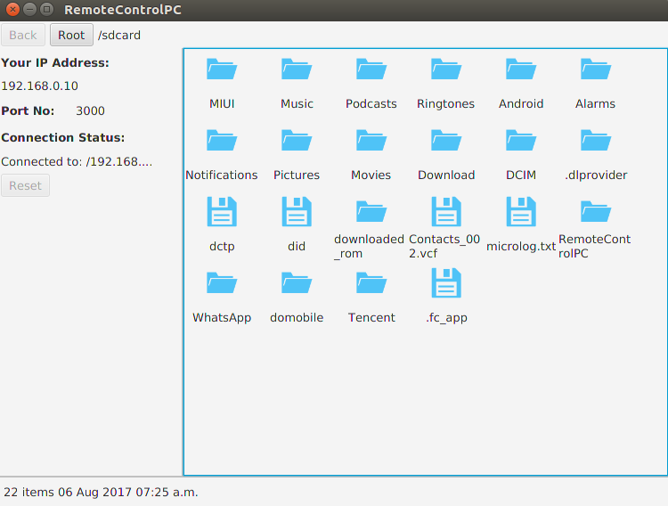
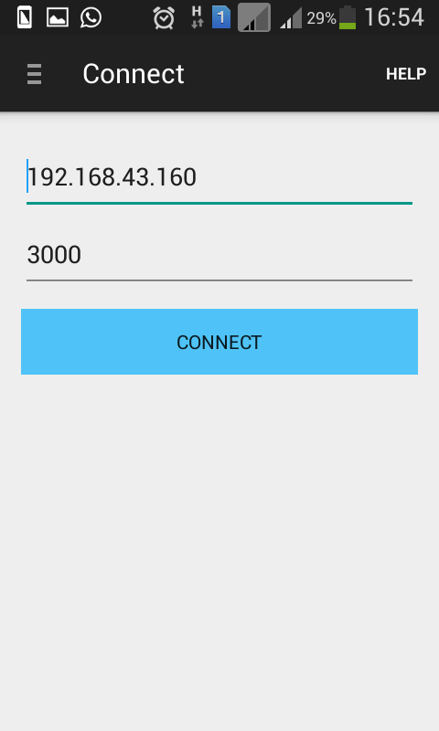
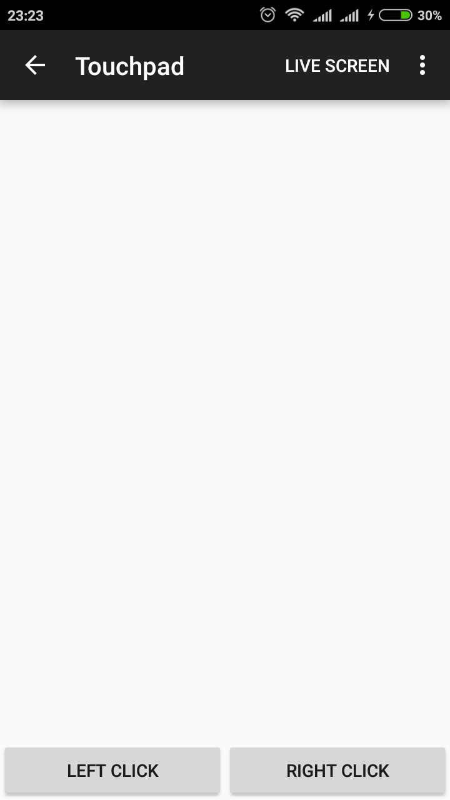
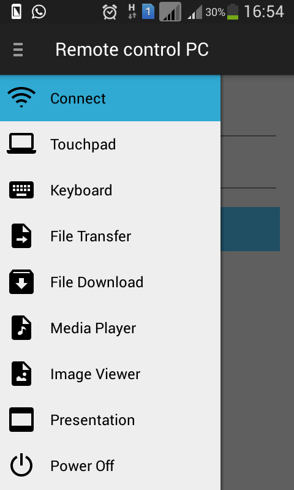
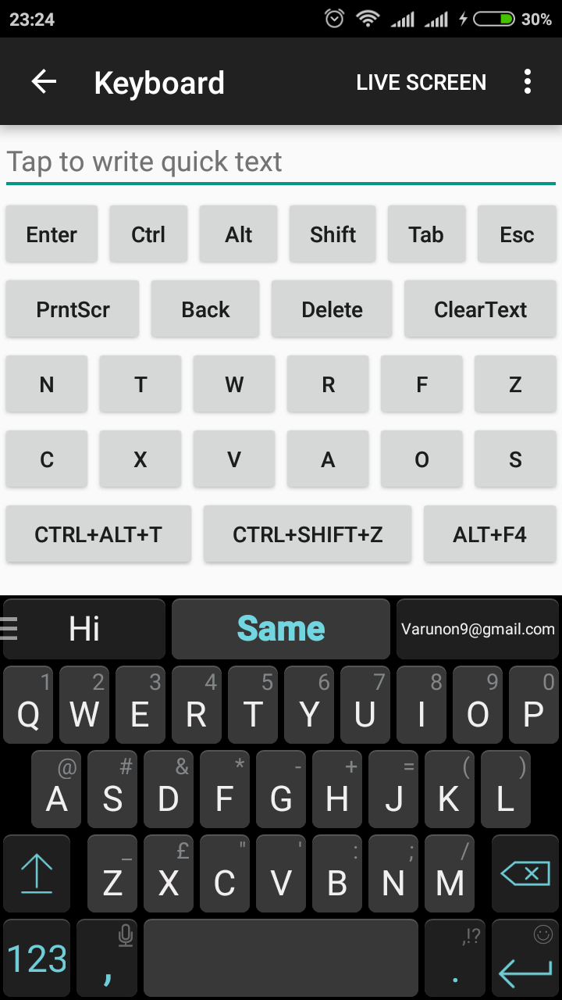
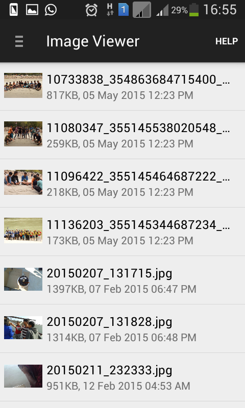
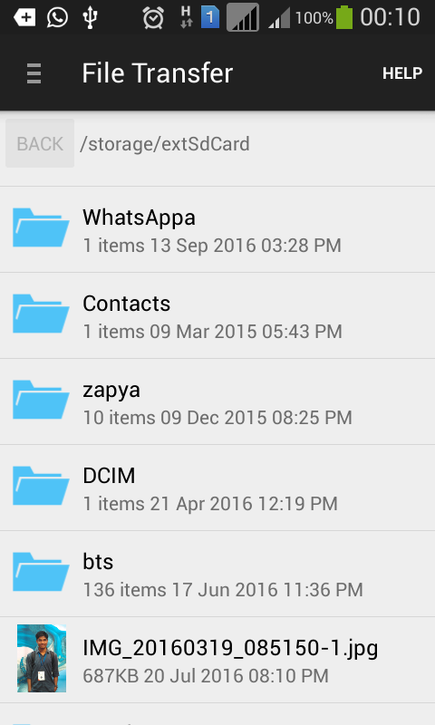
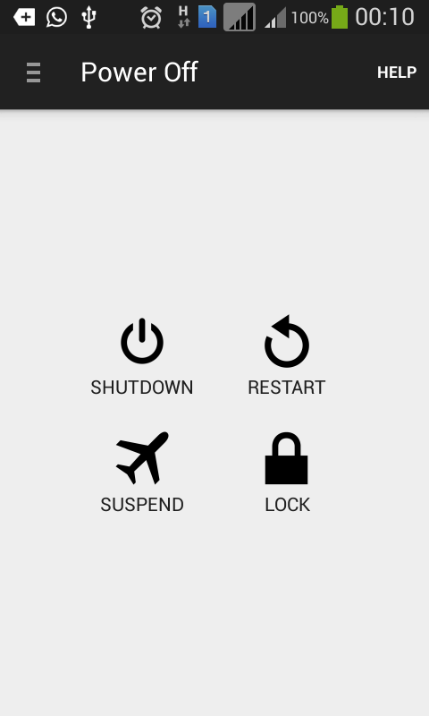
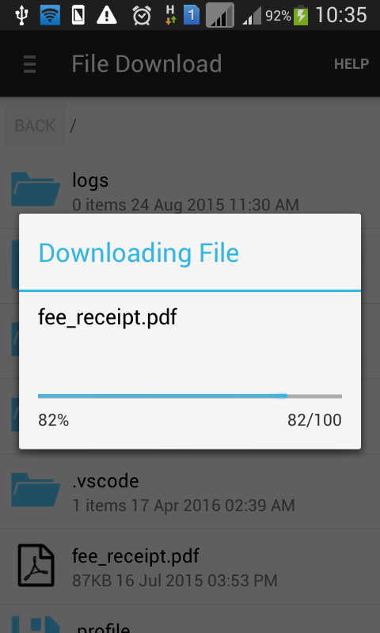
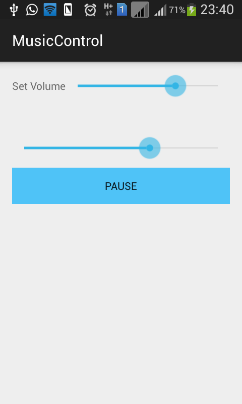

# Remote Control PC

Use your Android phone to control your Laptop.

### Features

1. Control Left Click, Right Click, Mouse Scroll
2. Type text 
3. Transfer files from phone to laptop
4. Download files from laptop to phone
5. Use your laptop as speaker to play mp3 files of phone
6. See images of phone on laptop
7. Control presentation on laptop via phone
8. Suspend, Restart or Shutdown your laptop using phone

## How does it work?

###### Step 1:
Start hotspot on phone and connect your laptop via wifi

###### Step 2:
Open the desktop app on your laptop (See instructions below)

###### Step 3:
Open Android app and enter connection details provided by desktop app to connect

###### Step 4:
Enjoy :sparkles: :boom: :wink:

### How to start desktop app?
1. Clone this Repository / Download zip 
2. Open terminal (Ctrl + Alt + T)
3. Type `cd /path/to/repository/RemoteControlPC-Desktop/dist`
4. Type `java -jar RemoteControlPC-Desktop.jar`
5. Lock icon to launcher

## Screenshots
|  |  |
| --- | --- |
| | |
| | |
| | |
| | |
| | |
| | |

## How to contribute?
Desktop part of this project has been developed in Netbeans while that of Android part in eclipse.

#### Steps to deploy app on your machine-
1. There are three folders-
    1. RemoteControlPC-Android- Android part, Import in Eclipse
    2. RemoteControlPC-Desktop- Desktop part, Import in Netbeans
    3. RemoteControlPC-Libraries- Libraries (Jar file) that is being used in android as well as desktop, Import in Netbeans
2. Library has a dist folder that contains jar file.
3. Add this jar file in build path of Desktop (Netbeans) as well as Android (Eclipse) part. See steps below.
4. To change/modify the java files inside library folder, import it in Netbeans and 'clean and build project' after changing.
5. Make sure to clean android as well as desktop part after modifying library files.

#### Steps to add jar file to android as well as dekstop part-
1. For Netbeans-
    1. Right click on project 
    2. Click Properties
    3. Click Libraries
    4. Add JAR/Folder -> Select jar from /path/to/repository/RemoteControlPC-Libraries/dist/RemoteControlPC-Libraries.jar
2. For Eclipse-
    1. Create libs folder in root directory if not already available
    2. Copy JAR file to the libs folder
    3. Right click on the Jar file and then select Build Path > Add to Build Path

#### To import RemoteControlPC-Android in Android Studio see this video: 
* https://www.youtube.com/watch?v=mMPT4M0p4T8

###### Feedbacks
1. You need Java 8 for desktop part (Netbeans)
2. If you are getting error in eclipse, you can import in Android-studio (for android part). 
3. You might need to change compile path for android part to Java 1.7. 
4. Keyboard has some issues particular to some android versions. 
  
